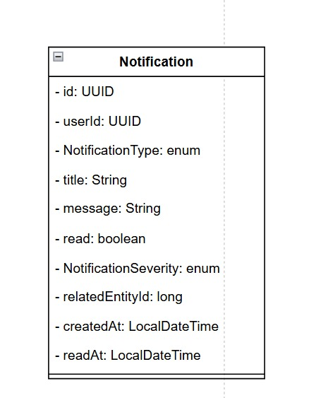
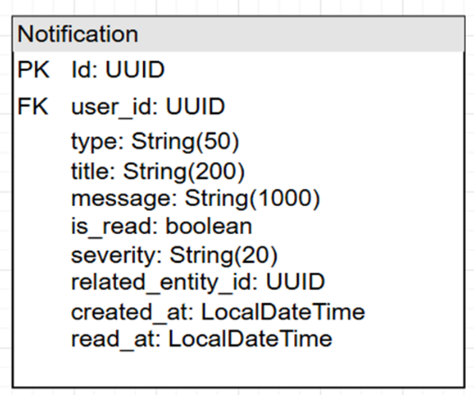
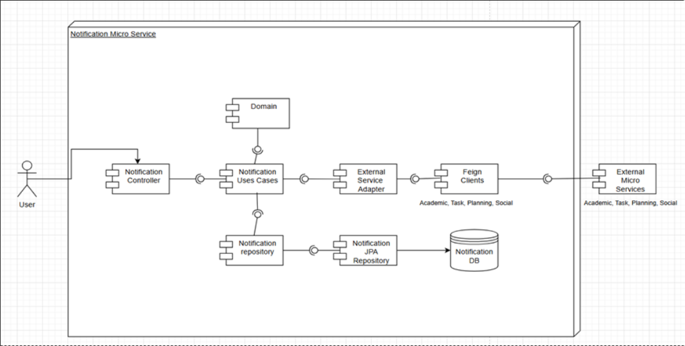

<div align="center">

# 🔔 AIBERT — Microservicio de Notificaciones

### *"Mantente informado, toma acción a tiempo"*

---

### 🛠️ Stack Tecnológico


### ☁️ Infraestructura & Calidad


### 🏗️ Arquitectura


</div>

---

## 📑 Tabla de Contenidos

1. [👤 Integrantes](#1--integrantes)
2. [🎯 Objetivo del Microservicio](#2--objetivo-del-microservicio)
3. [⚡ Funcionalidades Principales](#3--funcionalidades-principales)
4. [📋 Estrategia de Versionamiento y Branches](#4--manejo-de-estrategia-de-versionamiento-y-branches)
   - [4.1 Convenciones para crear ramas](#41-convenciones-para-crear-ramas)
   - [4.2 Convenciones para crear commits](#42-convenciones-para-crear-commits)
5. [⚙️ Tecnologías Utilizadas](#5--tecnologías-utilizadas)
6. [🧩 Funcionalidad](#6--funcionalidad)
7. [📊 Diagramas](#7--diagramas)
8. [⚠️ Manejo de Errores](#8--manejo-de-errores)
9. [🧪 Evidencia de Pruebas y Ejecución](#9--evidencia-de-pruebas-y-ejecución)
10. [🗂️ Organización del Código](#10--organización-del-código-scaffolding)
11. [🚀 Ejecución del Proyecto](#11--ejecución-del-proyecto)
12. [☁️ CI/CD y Despliegue en Azure](#12--cicd-y-despliegue-en-azure)
13. [🤝 Contribuciones](#13--contribuciones)

---

## 1. 👤 Integrantes

- Laura Valentina Santiago Márquez
- Juan Sebastian Murcia Yanquen
- Joshua David Quiroga Landazabal
- Juan Manuel Lopez Barrera

---

## 2. 🎯 Objetivo del Microservicio

El microservicio de Notificaciones tiene como objetivo centralizar la generación, almacenamiento y entrega de alertas académicas para los estudiantes dentro de la plataforma AIBERT. Este servicio recibe eventos de otros microservicios a través de Apache Kafka, los persiste en PostgreSQL y los expone mediante una API REST protegida con JWT. Además, evalúa en tiempo real el estado de carga de tareas y rendimiento académico del estudiante para generar alertas proactivas de sobrecarga (AIB-33) y bajo rendimiento (AIB-34), así como sugerencias de qué estudiar cada día (R23). Se integra con los microservicios de Tareas, Académico, Planificación y Social a través de clientes Feign para obtener el contexto necesario.

---

## 3. ⚡ Funcionalidades Principales

<div align="center">

<table>
  <thead>
    <tr>
      <th>💡 Funcionalidad</th>
      <th>Descripción</th>
    </tr>
  </thead>
  <tbody>
    <tr>
      <td><strong>Gestión de Notificaciones</strong></td>
      <td>Creación, consulta y marcado como leída de notificaciones persistidas en PostgreSQL. Soporta filtrado por notificaciones no leídas y conteo.</td>
    </tr>
    <tr>
      <td><strong>Consumo de Eventos Kafka</strong></td>
      <td>Escucha el topic <code>notification-events</code> para recibir eventos de otros microservicios (recordatorios de tareas, invitaciones de estudio, etc.) y persistirlos como notificaciones.</td>
    </tr>
    <tr>
      <td><strong>Alerta de Sobrecarga (AIB-33)</strong></td>
      <td>Evalúa en tiempo real la carga de tareas del estudiante frente a su disponibilidad semanal configurada y genera una alerta con variante <em>warning</em> o <em>critical</em> según la gravedad.</td>
    </tr>
    <tr>
      <td><strong>Alerta de Bajo Rendimiento (AIB-34)</strong></td>
      <td>Evalúa el promedio académico y las materias en riesgo del estudiante. Devuelve una lista priorizada de materias con nota proyectada y recomendación de acción personalizada.</td>
    </tr>
    <tr>
      <td><strong>Sugerencia de Estudio Diario (R23)</strong></td>
      <td>Aplica una fórmula de priorización (peso × 0.6 + 1/días × 0.4) sobre las tareas pendientes para recomendar qué materia estudiar primero hoy.</td>
    </tr>
    <tr>
      <td><strong>Integración vía Feign</strong></td>
      <td>Comunicación síncrona con task-service, academic-service, planning-service y social-service para obtener el contexto necesario en la evaluación de alertas.</td>
    </tr>
  </tbody>
</table>

</div>

---

## 4. 📋 Manejo de Estrategia de Versionamiento y Branches

### Estrategia de Ramas (Git Flow)

Manejaremos **GitFlow**, el modelo de ramificación para el control de versiones de Git.

#### `main`
- **Propósito:** rama **estable** con la versión final (lista para demo/producción).
- **Reglas:**
    - Solo recibe merges desde `release/*` y `hotfix/*`.
    - Cada merge a `main` debe crear un **tag** SemVer (`vX.Y.Z`).
    - Rama **protegida**: PR obligatorio, 1–2 aprobaciones, checks de CI en verde.

#### `develop`
- **Propósito:** integración continua de trabajo; base de nuevas funcionalidades.
- **Reglas:**
    - Recibe merges desde `feature/*` y también desde `release/*` al finalizar un release.
    - Rama **protegida** similar a `main`.

#### `feature/*`
- **Propósito:** desarrollo de una funcionalidad, refactor o spike.
- **Base:** `develop`.
- **Cierre:** se fusiona a `develop` mediante **PR**.

#### `release/*`
- **Propósito:** congelar cambios para estabilizar pruebas, textos y versiones previas al deploy.
- **Base:** `develop`.
- **Cierre:** merge a `main` (crear **tag** `vX.Y.Z`) **y** merge de vuelta a `develop`.
- **Ejemplo de nombre:** `release/1.3.0`

#### `hotfix/*`
- **Propósito:** corregir un bug **crítico** detectado en `main`.
- **Base:** `main`.
- **Cierre:** merge a `main` (crear **tag** de **PATCH**) **y** merge a `develop` para mantener paridad.
- **Ejemplo de nombre:** `hotfix/fix-kafka-consumer-bug`

---

### 4.1 Convenciones para **crear ramas**

#### `feature/*`
**Formato:**
```
feature/[nombre-funcionalidad]-AIBERT_[codigo-jira]
```

**Ejemplos:**
- `feature/kafka-notification-consumer-AIBERT-31`
- `feature/overload-alert-AIBERT-33`

**Reglas de nomenclatura:**
- Usar **kebab-case** (palabras separadas por guiones)
- Máximo 50 caracteres en total
- Descripción clara y específica de la funcionalidad
- Código de Jira obligatorio para trazabilidad

#### `release/*`
**Formato:**
```
release/[version]
```
**Ejemplo:** `release/1.0.0`

#### `hotfix/*`
**Formato:**
```
hotfix/[descripcion-breve-del-fix]
```

---

### 4.2 Convenciones para **crear commits**

#### **Formato:**
```
[tipo]: [descripción específica de la acción]
```

#### **Tipos de commit:**
- `[feature]`: Nueva funcionalidad
- `[fix]`: Corrección de errores
- `[docs]`: Cambios en documentación
- `[refactor]`: Refactorización de código
- `[test]`: Adición o corrección de pruebas

---

## 5. ⚙️ Tecnologías Utilizadas

| **Tecnología / Herramienta** | **Uso principal en el proyecto** |
|------------------------------|----------------------------------|
| **Java OpenJDK 21** | Lenguaje de programación base del microservicio. |
| **Spring Boot 3.4.3** | Framework base para la aplicación REST y gestión de dependencias. |
| **Spring Web** | Exposición de endpoints REST en la arquitectura hexagonal. |
| **Spring Data JPA** | Persistencia de notificaciones mediante el patrón Repository sobre PostgreSQL. |
| **PostgreSQL 16** | Base de datos relacional para almacenar notificaciones del usuario. |
| **Apache Kafka (Confluent 7.6.1)** | Broker de mensajería para consumir eventos asincrónicos de otros microservicios. |
| **Spring Kafka** | Integración de Kafka con Spring Boot mediante `@KafkaListener`. |
| **Spring Cloud OpenFeign** | Clientes REST declarativos para consumir task-service, academic-service, planning-service y social-service. |
| **Spring Security & JWT (JJWT 0.11.5)** | Autenticación y validación de tokens JWT en todas las peticiones a la API. |
| **Apache Maven** | Gestión de dependencias y empaquetado del proyecto. |
| **Lombok & MapStruct 1.5.5** | Generación de código boilerplate y mapeo automático entre entidades y DTOs. |
| **JUnit 5, Mockito & AssertJ** | Framework de pruebas unitarias con simulación de dependencias y aserciones fluidas. |
| **JaCoCo** | Generación de reportes de cobertura de código. |
| **Swagger (OpenAPI 3 / SpringDoc)** | Documentación interactiva de la API. |
| **Docker & Docker Compose** | Contenedorización del servicio, PostgreSQL, Kafka y Zookeeper. |

---

## 6. 🧩 Funcionalidad

---

### 1️⃣ Crear Notificación

Endpoint utilizado por otros microservicios para enviar una notificación a un usuario. También es invocado internamente desde el consumer de Kafka.

**Endpoint:** `POST /api/v1/notifications`

---

#### 📦 Estructura de la Solicitud (Request Body)

<div align="center">

| 🏷️ Campo | 🗃️ Tipo | ⚠️ Restricciones | 📝 Descripción |
|---|---|:---:|---|
| userId | Long | Obligatorio | ID del usuario destinatario. |
| type | String | Obligatorio | Tipo de notificación. Ver tipos válidos abajo. |
| title | String | Obligatorio | Título corto de la notificación. |
| message | String | Obligatorio | Cuerpo del mensaje. |
| severity | String | Obligatorio | Severidad: `HIGH`, `MEDIUM`, `LOW`, `INFO`. |
| relatedEntityId | Long | Opcional | ID de la entidad relacionada (tarea, materia, etc.). |

</div>

**Tipos de notificación válidos:** `TASK_REMINDER`, `STUDY_SESSION_INVITE`, `ACHIEVEMENT_UNLOCKED`, `GRADE_ALERT`, `DEADLINE_WARNING`, `OVERLOAD_ALERT`, `LOW_GRADE_ALERT`

---

#### 📦 Estructura de la Respuesta (Response)

<div align="center">

| 🏷️ Campo | 🗃️ Tipo | 📝 Descripción |
|---|---|---|
| id | Long | ID de la notificación creada. |
| userId | Long | ID del usuario destinatario. |
| type | NotificationType | Tipo de notificación. |
| title | String | Título de la notificación. |
| message | String | Cuerpo del mensaje. |
| severity | NotificationSeverity | Nivel de severidad. |
| read | boolean | Indica si fue leída (siempre `false` al crearse). |
| relatedEntityId | Long | ID de la entidad relacionada (puede ser nulo). |
| createdAt | LocalDateTime | Fecha y hora de creación. |
| readAt | LocalDateTime | Fecha y hora en que fue leída (nulo si no aplica). |

</div>

---

### 2️⃣ Consultar Notificaciones del Usuario

Retorna todas las notificaciones del usuario autenticado, ordenadas por fecha descendente.

**Endpoint:** `GET /api/v1/notifications/me`

> Requiere token JWT en el header `Authorization: Bearer {token}`.

**Response:** `List<NotificationResponse>` — mismos campos que la respuesta de creación.

---

### 3️⃣ Consultar Notificaciones No Leídas

Retorna únicamente las notificaciones no leídas del usuario autenticado.

**Endpoint:** `GET /api/v1/notifications/me/unread`

**Response:** `List<NotificationResponse>`

---

### 4️⃣ Contar Notificaciones No Leídas

Retorna el total de notificaciones no leídas del usuario autenticado.

**Endpoint:** `GET /api/v1/notifications/me/count`

---

#### 📦 Estructura de la Respuesta (Response)

<div align="center">

| 🏷️ Campo | 🗃️ Tipo | 📝 Descripción |
|---|---|---|
| count | Long | Cantidad de notificaciones no leídas. |

</div>

---

### 5️⃣ Marcar Notificación como Leída

Marca una notificación específica como leída. Verifica que pertenezca al usuario autenticado.

**Endpoint:** `PUT /api/v1/notifications/{id}/read`

<div align="center">

| 🏷️ Campo | 🗃️ Tipo | ⚠️ Restricciones | 📝 Descripción |
|---|---|:---:|---|
| id | Long | Obligatorio (Path) | ID de la notificación a marcar como leída. |

</div>

**Response:** `NotificationResponse` con `read: true` y `readAt` con la fecha actual.

---

### 6️⃣ Marcar Todas como Leídas

Marca todas las notificaciones no leídas del usuario autenticado como leídas.

**Endpoint:** `PUT /api/v1/notifications/me/read-all`

**Response:** `204 No Content`

---

### 7️⃣ Alertas en Tiempo Real (AIB-33 & AIB-34)

Consulta y evalúa en tiempo real el estado de sobrecarga y rendimiento académico del usuario autenticado. No consume la base de notificaciones: llama directamente a los servicios externos.

**Endpoint:** `GET /api/v1/stats/alerts`

---

#### 📦 Estructura de la Respuesta (Response)

<div align="center">

**`overloadAlert` (AIB-33):**

| 🏷️ Campo | 🗃️ Tipo | 📝 Descripción |
|---|---|---|
| active | boolean | `true` si hay sobrecarga detectada. |
| title | String | Título descriptivo de la alerta. |
| message | String | Mensaje explicativo con cantidad de tareas. |
| bannerVariant | String | `warning` (HIGH) o `critical` (CRITICAL). |
| requiredHours | int | Horas estimadas para completar las tareas pendientes. |
| availableHours | int | Horas disponibles según configuración semanal. |

**`lowGradeAlert` (AIB-34):**

| 🏷️ Campo | 🗃️ Tipo | 📝 Descripción |
|---|---|---|
| active | boolean | `true` si el rendimiento está por debajo del umbral. |
| title | String | Título descriptivo de la alerta. |
| message | String | Mensaje con el promedio actual. |
| bannerVariant | String | `warning` (promedio < 3.0) o `critical` (promedio < 2.5). |
| currentAverage | double | Promedio académico actual del estudiante. |
| threshold | double | Umbral mínimo de aprobación (3.0 por defecto). |
| subjectsAtRisk | List\<String\> | Nombres de las materias en riesgo. |
| riskSubjects | List\<RiskSubjectDTO\> | Detalle por materia: nombre, nota proyectada y recomendación. |
| alertMessage | String | Mensaje accionable con materias y notas proyectadas. |

</div>

---

### 8️⃣ Sugerencia de Estudio Diario (R23)

Aplica una fórmula de priorización sobre las tareas pendientes del usuario y retorna la materia o tarea con mayor urgencia para estudiar hoy.

**Fórmula:** `prioridad = peso × 0.6 + (1 / días_restantes) × 0.4`

**Endpoint:** `GET /api/v1/stats/suggestion`

Retorna `204 No Content` si no hay tareas pendientes.

---

#### 📦 Estructura de la Respuesta (Response)

<div align="center">

| 🏷️ Campo | 🗃️ Tipo | 📝 Descripción |
|---|---|---|
| suggestedTask | String | Nombre de la tarea sugerida. |
| suggestionReason | String | Justificación de la priorización. |
| subjectName | String | Materia a la que pertenece la tarea. |
| priority | double | Puntaje de prioridad calculado. |
| dueDate | LocalDate | Fecha límite de entrega. |

</div>

---

### 9️⃣ Integración Kafka — Consumo de Eventos

El microservicio escucha el topic `notification-events`. Cualquier microservicio del ecosistema AIBERT puede publicar un evento con el siguiente formato:

```json
{
  "userId": 1,
  "type": "TASK_REMINDER",
  "title": "Tarea próxima a vencer",
  "message": "Tu tarea 'Parcial Cálculo' vence mañana.",
  "severity": "HIGH",
  "relatedEntityId": 42
}
```

Eventos con `type` o `severity` desconocidos o nulos son **descartados** con un log de advertencia y no generan ninguna notificación.

---

## 7. 📊 Diagramas

Esta sección muestra los flujos de interacción entre los componentes del microservicio.

---

### 🔁 Diagrama de Secuencia — `GET /api/v1/stats/alerts`

Flujo completo de evaluación de alertas en tiempo real: autenticación JWT, consulta a task-service y academic-service vía Feign, y construcción de la respuesta consolidada.

<div align="center">

<!-- Insertar diagrama de secuencia aquí -->

</div>

---

### 🔁 Diagrama de Secuencia — Consumo de Evento Kafka

Flujo del consumer: recepción del evento desde el topic `notification-events`, validación de tipo y severidad, y persistencia en PostgreSQL.

<div align="center">

<!-- Insertar diagrama de secuencia aquí -->

</div>

---

### 🔁 Diagrama de Secuencia — `GET /api/v1/notifications/me`

Flujo de consulta de notificaciones del usuario: validación JWT, extracción del `userId` del principal y consulta al repositorio.

<div align="center">

<!-- Insertar diagrama de secuencia aquí -->

</div>

---
### 🔁 Diagrama de Clases — `Dominio`

El modelo Notification encapsula toda la info de una notificación (tipo, título, mensaje, severidad, estado de lectura) usando enums para los campos categóricos.


<div align="center">



</div>

---

### 🔁 Diagrama de Entidad relación 

La entidad mapea esa misma entidad a la BD con sus tipos SQL reales (UUID, String con límites, boolean, LocalDateTime).

<div align="center">



</div>

---

### 🔁 Diagrama de Componentes Generales

El flujo va User → Controller → Use Cases → (repositorio a la BD) y (External Service Adapter → Feign Clients → microservicios externos como Academic, Task, Planning, Social).

<div align="center">



</div>

---

### 🏗️ Diagrama de Arquitectura Hexagonal

Distribución de responsabilidades del microservicio por capas.

<div align="center">

<!-- Insertar diagrama de arquitectura aquí -->

</div>

**Componentes clave:**
- **Entrada REST:** `NotificationController`, `AlertController`, `SuggestionController`
- **Entrada Kafka:** `NotificationEventConsumer`
- **Casos de Uso:** `CreateNotificationUseCase`, `GetNotificationsUseCase`, `AlertService`, `DailyStudyService`, `NotificationDispatcher`
- **Dominio:** `Notification`, `NotificationType`, `NotificationSeverity`, `UserId`
- **Puertos In:** `CreateNotificationPort`, `GetNotificationsPort`, `MarkNotificationReadPort`, `GetStatsAlertsPort`, `GetDailySuggestionPort`
- **Puertos Out:** `NotificationRepositoryPort`, `TaskServicePort`, `AcademicServicePort`, `WeeklyAvailabilityPort`, `PlanningServicePort`, `SocialServicePort`
- **Adaptadores Out:** `NotificationRepositoryAdapter`, `TaskServiceAdapter`, `AcademicServiceAdapter`, `PlanningServiceAdapter`, `SocialServiceAdapter`

---

## 8. ⚠️ Manejo de Errores

El microservicio implementa un **mecanismo centralizado de manejo de errores** a través de `GlobalExceptionHandler` (`@ControllerAdvice`), que captura excepciones de dominio y de validación y las transforma en respuestas HTTP uniformes.

### 📊 Tipos de errores manejados

<div align="center">

| 🔢 **Código HTTP** | ⚠️ **Escenario** |
|:------------------:|:----------------|
|  | Campos inválidos o ausentes en la petición (`InvalidNotificationException`) |
|  | Token JWT ausente, expirado o inválido |
|  | El usuario intenta acceder a una notificación que no le pertenece |
|  | Notificación no encontrada (`NotificationNotFoundException`) |
|  | Servicio externo (task-service, academic-service, etc.) no disponible |

</div>

---

## 9. 🧪 Evidencia de Pruebas y Ejecución

https://aibert-notification-service-qa.yellowwave-cb2d91fc.centralus.azurecontainerapps.io/swagger-ui/index.html

El proyecto incluye pruebas unitarias para todos los casos de uso, adaptadores de infraestructura y controladores REST.

### Clases de prueba incluidas

| Clase de Prueba | Componente cubierto |
|---|---|
| `AlertServiceTest` | Lógica de evaluación de alertas AIB-33 y AIB-34 |
| `NotificationDispatcherTest` | Consolidación de alertas en `AlertsResponseDTO` |
| `AcademicServiceAdapterTest` | Mapeo del DTO externo al modelo de dominio |
| `AlertControllerTest` | Endpoints REST con MockMvc y seguridad |
| `NotificationEventConsumerTest` | Validación y descarte de eventos Kafka |

### 🚀 Cómo ejecutar las pruebas

#### **1️⃣ Ejecutar todas las pruebas**
```bash
mvn clean test
```

#### **2️⃣ Generar reporte de cobertura con JaCoCo**
```bash
mvn clean test jacoco:report
```
El reporte HTML se generará en `target/site/jacoco/index.html`.

---

## 10. 🗂️ Organización del Código (Scaffolding)

El microservicio sigue una **arquitectura hexagonal (puertos y adaptadores)**:

```
notification-service/
│
├── 📁 src/
│   ├── 📁 main/
│   │   ├── 📁 java/com/aibert/dosw/
│   │   │   ├── 📁 application/                        # 🔵 CAPA DE APLICACIÓN
│   │   │   │   ├── 📁 dto/
│   │   │   │   │   ├── 📁 external/                   # DTOs de datos de servicios externos
│   │   │   │   │   ├── 📁 request/                    # DTOs de entrada REST
│   │   │   │   │   ├── 📁 response/                   # DTOs de salida REST
│   │   │   │   │   └── 📁 stats/                      # DTOs de alertas y sugerencias
│   │   │   │   ├── 📁 mapper/                         # NotificationMapper (MapStruct)
│   │   │   │   └── 📁 usecase/
│   │   │   │       ├── 📁 notification/               # Casos de uso de notificaciones
│   │   │   │       └── 📁 stats/                      # AlertService, DailyStudyService, Dispatcher
│   │   │   │
│   │   │   ├── 📁 config/                             # ⚙️ Seguridad JWT, Feign, Swagger
│   │   │   │
│   │   │   ├── 📁 domain/                             # 🟢 CAPA DE DOMINIO
│   │   │   │   ├── 📁 exceptions/                     # InvalidNotificationException, NotificationNotFoundException
│   │   │   │   ├── 📁 model/
│   │   │   │   │   ├── 📁 notification/               # Notification, NotificationType, NotificationSeverity
│   │   │   │   │   └── 📁 valueObjects/               # UserId
│   │   │   │   └── 📁 ports/
│   │   │   │       ├── 📁 in/                         # Puertos de entrada (casos de uso)
│   │   │   │       └── 📁 out/                        # Puertos de salida (repositorio, feign)
│   │   │   │
│   │   │   ├── 📁 entrypoints/                        # 🟡 ADAPTADORES DE ENTRADA
│   │   │   │   ├── 📁 advice/                         # GlobalExceptionHandler
│   │   │   │   └── 📁 rest/
│   │   │   │       ├── 📁 controller/                 # NotificationController, AlertController, SuggestionController
│   │   │   │       └── 📁 mapper/                     # NotificationRestMapper
│   │   │   │
│   │   │   └── 📁 infrastructure/                     # 🟠 ADAPTADORES DE SALIDA
│   │   │       ├── 📁 adapters/
│   │   │       │   ├── 📁 adapter/                    # Implementaciones de puertos out
│   │   │       │   └── 📁 persistence/                # NotificationEntity, mapper JPA, repositorio
│   │   │       ├── 📁 external/
│   │   │       │   ├── 📁 dto/                        # DTOs de respuesta Feign
│   │   │       │   └── 📁 feign/                      # AcademicServiceClient, TaskServiceClient, etc.
│   │   │       └── 📁 messaging/                      # NotificationEventConsumer
│   │   │           └── 📁 event/                      # NotificationEvent (modelo Kafka)
│   │   │
│   │   └── 📁 resources/
│   │       └── 📄 application.yml                     # Configuración por perfil (local, qa)
│   │
│   └── 📁 test/                                       # 🧪 PRUEBAS UNITARIAS
│       ├── 📁 java/com/aibert/dosw/
│       │   ├── 📁 application/usecase/                # AlertServiceTest, NotificationDispatcherTest
│       │   ├── 📁 entrypoints/rest/controller/        # AlertControllerTest
│       │   └── 📁 infrastructure/
│       │       ├── 📁 adapters/adapter/               # AcademicServiceAdapterTest
│       │       └── 📁 messaging/                      # NotificationEventConsumerTest
│       └── 📁 resources/
│           └── 📄 application.yml                     # Configuración H2 para pruebas
│
├── 📄 docker-compose.yml                              # PostgreSQL, Kafka, Zookeeper, backend
└── 📄 pom.xml                                         # Configuración Maven y dependencias
```

---

## 11. 🚀 Ejecución del Proyecto

### 📋 Prerrequisitos
- **Java 21**
- **Maven 3.8+**
- **Docker y Docker Compose**

### 🛠️ Opción 1: Ejecución Local (Maven)

Requiere una base de datos PostgreSQL corriendo localmente y las variables de entorno configuradas.

```bash
mvn spring-boot:run -Dspring-boot.run.profiles=local
```

Variables de entorno requeridas:
```
DB_URL=jdbc:postgresql://localhost:5432/notification_db
DB_USER=tu_usuario
DB_PASSWORD=tu_password
JWT_SECRET=tuSecretoJWT
```

📍 **URL Local:** `http://localhost:8080`  
📚 **Swagger UI:** `http://localhost:8080/swagger-ui.html`

### 🐳 Opción 2: Ejecución con Docker Compose

Levanta PostgreSQL, Zookeeper, Kafka y el backend en contenedores:

```bash
docker-compose up --build -d
```

Configura las variables de entorno en un archivo `.env` en la raíz del proyecto:
```
DB_NAME=notification_db
DB_URL=jdbc:postgresql://notification-db:5432/notification_db
DB_USER=tu_usuario
DB_PASSWORD=tu_password
SPRING_PROFILES_ACTIVE=qa
```

📍 **URL:** `http://localhost:8080`  
📚 **Swagger UI:** `http://localhost:8080/swagger-ui.html`  
🔌 **Kafka broker:** `localhost:29092` (desde el host)

---

## 12. ☁️ CI/CD y Despliegue en Azure

El proyecto tiene capacidad para desplegarse mediante GitHub Actions hacia Azure App Service o un entorno contenedorizado en la nube. Se definen perfiles `local` y `qa` en `application.yml` para gestionar la cadena de conexión de la base de datos y las URLs de servicios externos. Las variables sensibles (`DB_PASSWORD`, `JWT_SECRET`) se inyectan como secrets en el pipeline de CI/CD y nunca se versiona en el repositorio.

---

## 13. 🤝 Contribuciones

### Metodología
Se utiliza **Scrum** con iteraciones cortas, asegurando entregas continuas y mejora de valor. Las ramas principales (`main` y `develop`) son protegidas y todos los PRs deben cumplir validación de CI antes de aprobarse.

<div align="center">

### 🏆 Proyecto AIBERT


</div>
